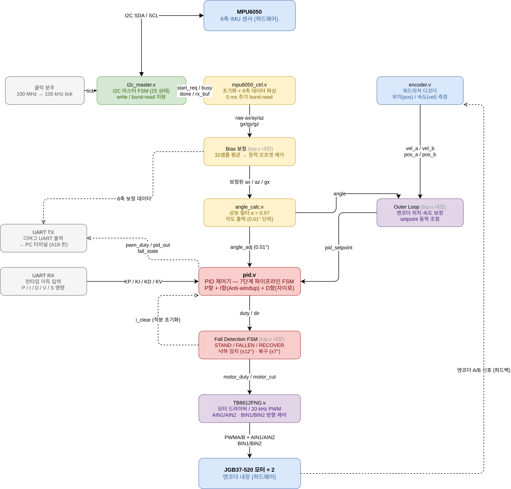
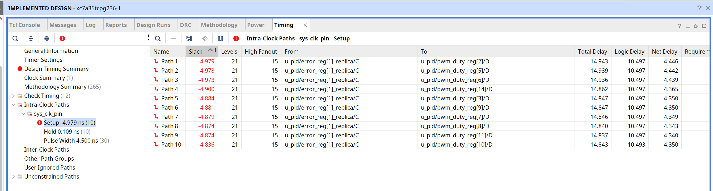

# 🤖 Project 5 Balancing Robot

## **1. Project Summary (프로젝트 요약)**
Basys3(Artix-7 FPGA)와 Encoder가 있는 Gear DC 모터(JGB37-520)를 활용하여  밸런싱 로봇 제작


## 2. Key Features (주요 기능)

### ⚖️ 밸런싱 기능
- PID 제어 알고리즘 기반의 실시간 자세 추정 및 균형 유지 시스템 구현
- UART 및 블루투스 무선 통신을 활용한 원격 제어 파라미터 튜닝 기능


## 🛠 3.  Tech Stack (기술 스택)


### 3.1 Language (사용언어)


### 3.2 Development Environment (개발 환경)
|  |  |
| :---: | :---: |
| **AMD Vivado** | **VS code** |

### 3.3 Collaboration Tools (협업 도구)


## 📂 4.  Project Structure (프로젝트 구조)

### 4.1 Project Tree (프로젝트 트리)

```
Project_5_Balancing-Robot/
├── Balacing_Robot.srcs/                # 핵심 하드웨어 설계 소스 및 제약 파일
│   ├── constrs_1/
│   │   └── imports/
│   │       └── fpga/
│   │           └── Basys-3-Master.xdc  # Basys3 보드 핀 할당 및 물리 제약 파일
│   └── sources_1/
│       └── new/                        # Verilog HDL 설계 소스 코드 (.v)
│           ├── top.v                   # 시스템을 통합하는 최상위 메인 제어 모듈
│           ├── pid.v                   # 로봇 균형 제어용 핵심 PID 알고리즘
│           ├── angle_calc.v            # 원시 센서 데이터 기반 기울기 각도 산출
│           ├── mpu6050_ctrl.v          # MPU6050 자이로 및 가속도 센서 제어기
│           ├── mpu6050_debug_uart.v    # 10진수 변환 및 디버깅용 UART 출력 로직
│           ├── encoder.v               # 홀 엔코더 신호 분석 및 바퀴 속도 측정
│           ├── TB6612FNG.v             # DC 기어 모터 제어용 PWM 및 방향 신호 생성
│           ├── i2c_master.v            # 센서 데이터 수집용 I2C 마스터 프로토콜
│           ├── uart_bluetooth.v        # 조종기 블루투스 제어 명령 수신 및 디코더
│           └── clk_divider.v           # 시스템 타이밍 동기화용 클럭 분주기
├── Balacing_Robot.tcl                  # Vivado 프로젝트 환경 자동 복원 스크립트
├── README.md                           # 프로젝트 전체 개요 및 빌드 가이드 문서
├── REPORT.md                           # 실험 과정, 트러블슈팅 및 결과 분석 보고서
└── .gitignore                          # Git 버전 관리 제외 항목 설정 파일
```

### 4.2 Hardware BlockDiagram (하드웨어 블록다이어그램)


### 4.3 RTL Block-Diagram (RTL 블록다이어그램)


### 4.4 Flow Chart (순서도)



## 🏁 5. Final Product & Demonstration (완성품 및 시연)

### 5.1 Final Product (완성품)
<br>

| **전면 (Front)** | **상단 (Top)** | **하단 (Bottom)** |
| :---: | :---: | :---: |
|  |  |  |

<br>

| **후면 (Back)** | **가속도,자이로센서 (MPU6050)** | **모터드라이버 (TB6612FNG)** |
| :---: | :---: | :---: |
|  |  |  |

<br>

### 5.2  Demonstration (시연 영상)

<a href="[https://youtu.be/Q5w-YqaQoTA?si=gKLwD9LEihRDKcvt](https://youtu.be/ukmD3Q1Xvkw?si=nxDMKmhs5eremLpZ)" target="_blank">
  
</a>

*이미지를 클릭하면 시연 영상(유튜브)로 이동합니다.*


## 6. Troubleshooting (문제 해결 기록)

### 6.1 타이밍에러 (Timing Error)


🔍  **Issue (문제 상황)**



- Vivado 합성 및 구현(Implementation) 과정에서 로그창에 Setup Time Violation 으로 인한 타이밍 에러 메시지가 발생

❓ **Analysis (원인 분석)**

- PID 제어기의 복잡한 곱셈 연산으로 인해 조합 논리(Combinational Logic) 의 임계 경로(Critical Path) 가 길어져 단일 클럭 사이클 내에 연산을 완료하지 못함


❗ **Action (해결 방법)**

- 단일 주기에 집중된 연산 경로를 여러 단계의 상태 머신(FSM) 파이프라인 구조로 분할

✅ **Result (결과)**

- 타이밍 위반 에러를 해결하고 **Timing Closure** 를 성공적으로 달성

---

### 6.2 데이터 시인성 (Data Visibility) 


🔍  **Issue (문제 상황)**

- 센서 값과 제어 파라미터를 모니터링할 때 16진수(Hexadecimal) 원시 데이터가 그대로 출력되어 직관적인 튜닝이 불가능

❓ **Analysis (원인 분석)**

- Verilog에는 C언어 같은 **printf**같은 함수가 없어서 UART로 보내는 ASCII 코드값을 변환시킬 수가 없음

❗ **Action (해결 방법)**

- Binary-to-BCD 변환기와 상태 머신 기반의 ASCII 디코더 회로를 설계

✅ **Result (결과)**

- 성공적으로 MPU6050센서의 출력값과 PID제어를 위한 입력값을 10진수로 제어함

---

### 6.3  제어 불안정성 (CONTROL INSTABILITY) 


🔍  **Issue (문제 상황)**

- 진동으로 인한 단순 PID 제어의 평형 유지에 한계가 발생
- 짧은 주기동안 과도한 변화로 모터드라이버 과열

❓ **Analysis (원인 분석)**

- 모든 각도에 걸친 PID 제어로 인한 지속적인 진동 발생

❗ **Action (해결 방법)**

- 로봇의 각도가 작으면 최대한 PWM을 줄이는 데드존 설정 
- 오차 크기(소/중/대) 기반의 구간별 비선형 제어 도입


✅ **Result (결과)**

- 진동 감소 및 구간별 회복력 향상을 통한 안정적인 상태 달성


